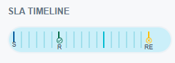

# SLA Timeline

The **Service Level Agreement (SLA) Timeline** helps you track important milestones for resolving a ticket, ensuring it aligns with the customer's package. It includes:  

- **Start Time(S)**: When the ticket was created.  
- **Response Time(R)**: The deadline to respond to the ticket.  
- **Current Time(C)**: Shows the current time if the ticket is still open.  
- **Resolution Time(RE)**: The deadline to resolve the ticket completely.  

This feature ensures the ticket is handled within the timelines promised in the customer’s package.

<!-- NEED TO CHANGE IMAGE -->

{ style="display: block; margin: auto;" }

<i style="font-size: 14px; color: grey;">Fig. SLA Timeline</i>

 

If the SLA timeline goal is achieved, a checkmark will appear under Response Time **(R)** and Resolution Time **(RE)**. If not, a cross mark will be displayed.