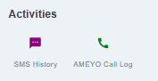
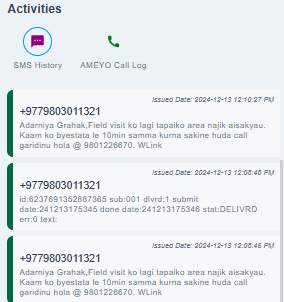

# Activities
This section consists of two features that are:

1. SMS History.
1. Ameyo Call Log.

{ style="display: block; margin: auto;" }

<i style="font-size: 14px; color: grey;">Fig. Activities</i>

## SMS History

The feature allows you to view SMS messages sent from the company to the client's primary registered number, providing a detailed record of communication for reference or verification purposes.

{ style="display: block; margin: auto;" }

<i style="font-size: 14px; color: grey;">Fig. SMS History</i>

## Ameyo Call Log

This feature lets you listen to past call recordings with the client, making it easier to understand previous conversations, verify details, and offer more personalized support.

<!-- NEED TO ADD IMAGE -->