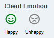

# Client Emotion

This feature helps you gauge the client’s mood, whether they sound happy or sad, so you can set their emotional status when opening a ticket and provide better support. The unselected option will appear in grey.

{ style="display: block; margin: auto;" }

<i style="font-size: 14px; color: grey;">Fig. Client Emotion</i>

 