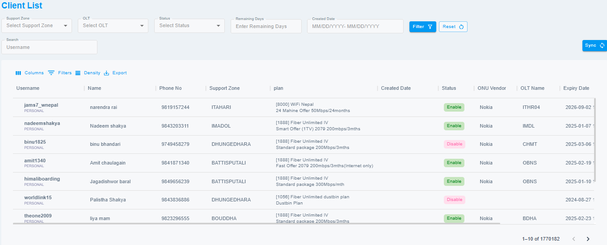
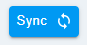
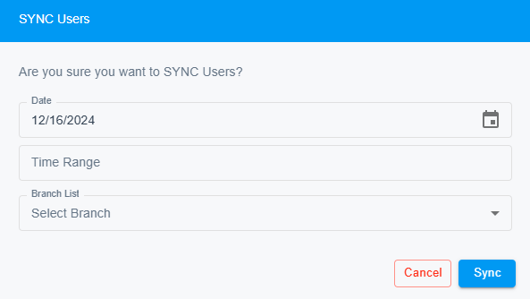
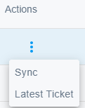

# Client List

This section offers an easy-to-read table of all clients, showing important details like username, phone number, support zone, plan, creation date, status, ONU vendor, OLT name, expiry date, and remaining days. You can also quickly access actions to view the latest ticket or sync client details.

{ style="display: block; margin: auto;" }

<i style="font-size: 14px; color: grey;">Fig. Client List</i>

 

## Sync

{ style="display: block; margin: auto;" }

<i style="font-size: 14px; color: grey;">Fig. Sync</i>

 
This feature allows you to manually synchronize the client’s details, ensuring the information displayed is up-to-date and accurate.

It also give you a customized time frame from which you want to synchronize the data from branch where you belong.

{ style="display: block; margin: auto;" }

<i style="font-size: 14px; color: grey;">Fig. Customize Sync</i>

 

## Actions

{ style="display: block; margin: auto;" }

<i style="font-size: 14px; color: grey;">Fig. Actions</i>

 

**Sync:**
This feature allows you to manually sync the customer's information in cSupport if they have been updated recently.

**Latest Ticket:**
This feature redirects you to the latest ticket of the customer in ticket view. 

!!! note
    You will only be allowed to view the usernames of the branchs that you belong to.