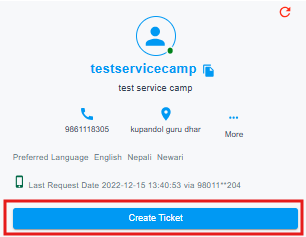
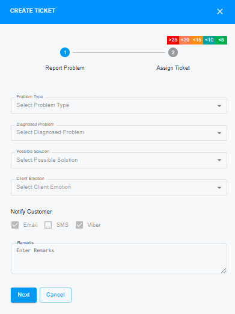
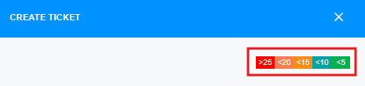
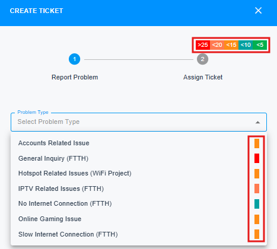
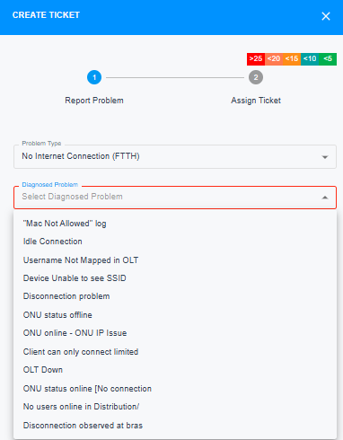
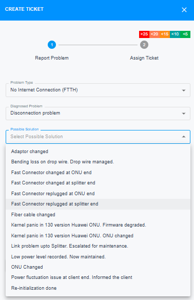
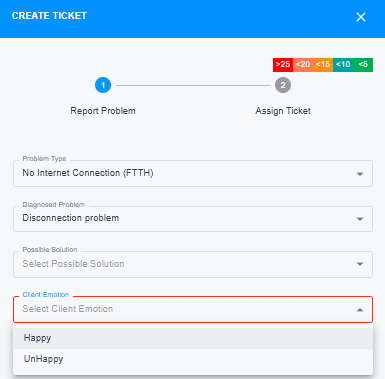
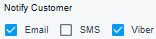
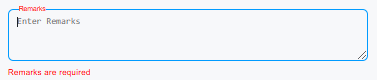

# Create Ticket
This section comes under customer details. It lets you create a ticket based on the client's concerns, assign it to the right person or team, and even schedule a field visit if necessary. The issues and diagnoses are the same as those in the eSupport.

{ style="display: block; margin: auto;" }

<i style="font-size: 14px; color: grey;">Fig. Create Ticket</i>

 

After clicking on "Create Ticket" a side bar will be visible. This is the section through which, you can choose between different problem types and diagnosed problems as per the client's issue.

{ style="display: block; margin: auto;" }

<i style="font-size: 14px; color: grey;">Fig. Create Ticket Sidebar</i>

 

This section contains the following components:

1. [Ticket Indicator](#ticket-indicator)
1. [Problem Type.](#problem-type)
1. [Diagnosed Problem.](#diagnosed-problem) 
1. [Possible Solution.](#possible-solutions) 
1. [Client Emotion.](#client-emotion)
1. [Notify Customer.](#notify-customer)
1. [Remarks.](#remarks)

## Ticket Indicator 

This is a new feature that allows you to track the number of tickets opened for a client across different problem types. As the status changes, color schemes are updated. If more than 25 tickets are opened for the same problem type, a red indicator will appear on the right side. The index for color scheme with the number of tickets that are opened have been attached at the top right corner.

{ style="display: block; margin: auto;" }

<i style="font-size: 14px; color: grey;">Fig. Ticket Indicator</i>

## Problem Type

The ticket indicator is displayed on the right side of each problem type, as shown in the image below:

{ style="display: block; margin: auto;" }

<i style="font-size: 14px; color: grey;">Fig. Problem Type</i>

!!! note
    This section is  mandatory while opening a ticket.

## Diagnosed Problem
{ style="display: block; margin: auto;" }

<i style="font-size: 14px; color: grey;">Fig. Diagnosed Problem</i>

!!! note
    This section is  mandatory while opening a ticket.

## Possible Solutions
{ style="display: block; margin: auto;" }

<i style="font-size: 14px; color: grey;">Fig. Possible Solutions</i>

!!! note
    This section is `not` mandatory.

## Client Emotion

{ style="display: block; margin: auto;" }

<i style="font-size: 14px; color: grey;">Fig. Client Emotions</i>

!!! note
    This section is  mandatory while opening a ticket.

## Notify Customer

By default, notifications are enabled only through Email and Viber. Once a ticket is created, both an email and a Viber notification are sent to the client's email address and primary number via Viber.

{ style="display: block; margin: auto;" }

<i style="font-size: 14px; color: grey;">Fig. Notify Customer</i>

## Remarks

{ style="display: block; margin: auto;" }

<i style="font-size: 14px; color: grey;">Fig. Remarks</i>

!!! note
    This section is  mandatory while opening a ticket.

