# Customer Details
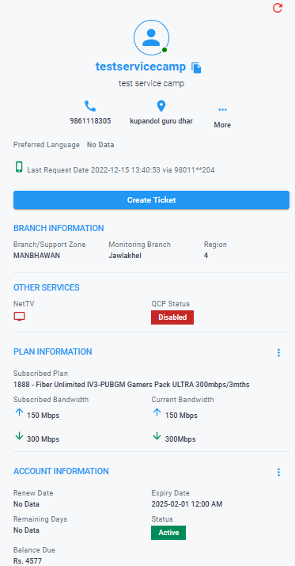{ style="display: block; margin: auto;" }

<i style="font-size: 14px; color: grey;">Fig. Customer Details</i>

This is the section where you can find the details of the customer which includes: Contact Information, Branch information, Plan Information, Accout Information and more.

## More

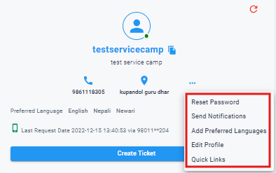{ style="display: block; margin: auto;" }

<i style="font-size: 14px; color: grey;">Fig. More Options</i>

By clicking on the more option you will find the following features:

1. Reset Password.
1. Send Notification.
1. Add Preferred Languages.
1. Edit Profile.
1. Quick Links.

### Reset Password

This is the feature through which you can reset the Online Service Password(OSP) of the client. Once you click on this option, it will ask you for confirmation.

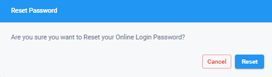{ style="display: block; margin: auto;" }

<i style="font-size: 14px; color: grey;">Fig. Reset Password</i>

As soon as you click on **`Reset`** the password will be sent to the primary contact number.

### Send Notifications

This is the feature through which you can send notifications to the client's both primary and secondary contact numbers from the available templates. 

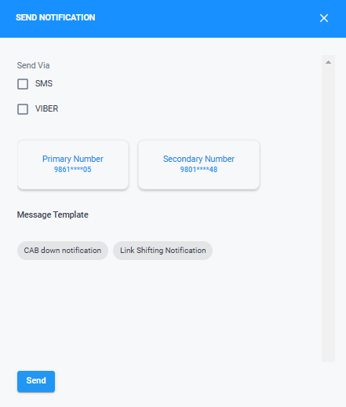{ style="display: block; margin: auto;" }

<i style="font-size: 14px; color: grey;">Fig. Send Notifications</i>

### Add Preferred Languages

This feature enables you to add the language preferred by the client for communication. You can select multiple languages available in the list.

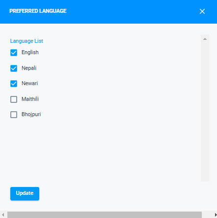{ style="display: block; margin: auto;" }

<i style="font-size: 14px; color: grey;">Fig. Send Notifications</i>

Once the languages are updated, it will be shown in the customer details section:

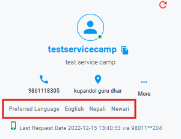{ style="display: block; margin: auto;" }

<i style="font-size: 14px; color: grey;">Fig. Preferred Languages</i>

### Edit Profile
This section allows you to edit customer details, including their name, address, contact numbers, and email. However, updating the primary contact number requires sending an OTP to the customer for verification to ensure security.

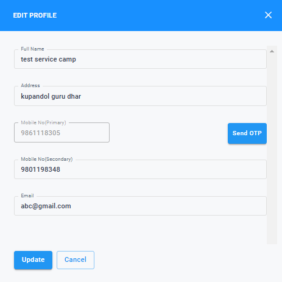{ style="display: block; margin: auto;" }

<i style="font-size: 14px; color: grey;">Fig. Edit Profile</i>

### Quick Links

The feature allows you to access other applications without having to enter URLs manually. It currently consists of 4 applications:

1. Client Followup (CFU).
1. Retail Billing.
1. NetTv Dashboard.
1. CRM 360.

<!-- NEED TO CHANGE IMAGE -->
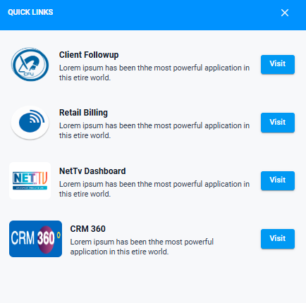{ style="display: block; margin: auto;" }

<i style="font-size: 14px; color: grey;">Fig. Quick Links</i>

## Plan Information

This section provides information about the package the client is currently subscribed to. It is divided into two subsections: 

1. Package Details.
1. Other Packages.

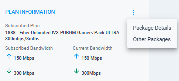{ style="display: block; margin: auto;" }

<i style="font-size: 14px; color: grey;">Fig. Plan Information</i>

### Package Details
 This sections contains detailed information about the package which includes Duration, Number of NetTv that can be added, Price and more.

<!-- NEED TO CHANGE IMAGE -->
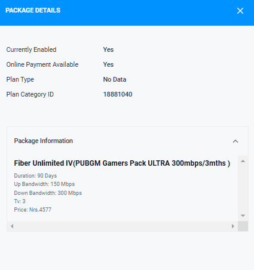{ style="display: block; margin: auto;" }

<i style="font-size: 14px; color: grey;">Fig. Package Details</i>

<!-- NEED TO CHANGE IMAGE -->
### Other Packages
 This section allows you to compare between different packages. It provides a list of packages that the client can change to with different bandwidth and price plans.

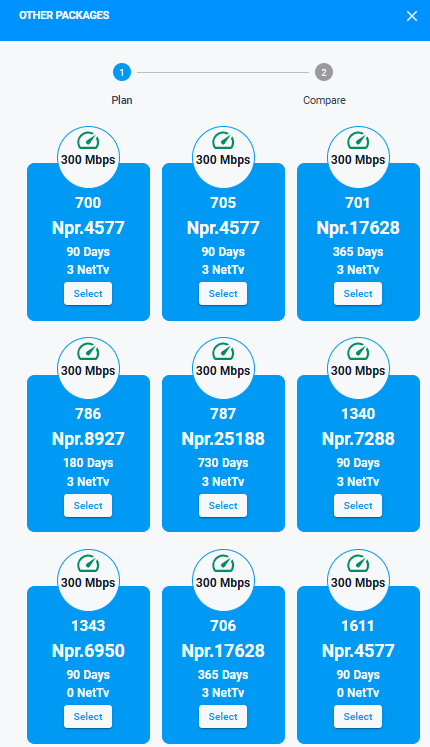{ style="display: block; margin: auto;" }

<i style="font-size: 14px; color: grey;">Fig. Select Package</i>

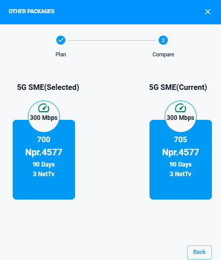{ style="display: block; margin: auto;" }

<i style="font-size: 14px; color: grey;">Fig. Compare Package</i>

<!-- NEED TO CHANGE IMAGE -->

## Account Information

 This section provides key details about the customer's subscription, including the status, package expiry date, any outstanding balance due, and the remaining days before the package expires. It also has two sub sections: 

1. Payment Details.
1. Account Extend.

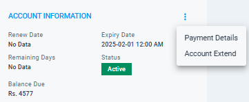{ style="display: block; margin: auto;" }

<i style="font-size: 14px; color: grey;">Fig. Account Information</i>

<!-- NEED TO CHANGE IMAGE -->
### Payment Details

 This section contains the client's payment statement, allowing verification of the payment amount and the date the client made the payment.

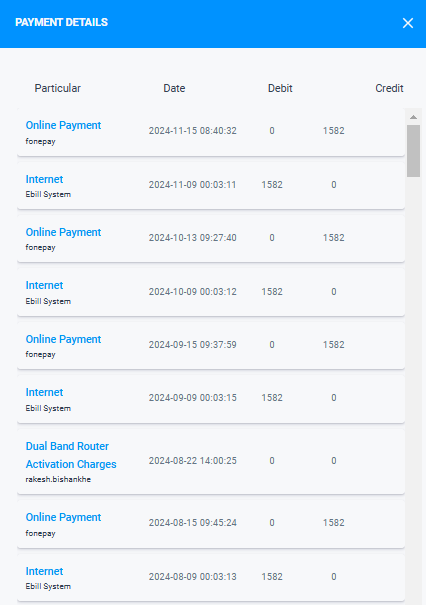{ style="display: block; margin: auto;" }

<i style="font-size: 14px; color: grey;">Fig. Statement</i>

!!! note
    The latest transaction is displayed first in this section.

### Account Extend

 This section allows you to extend the customer's account without the having to use another application.

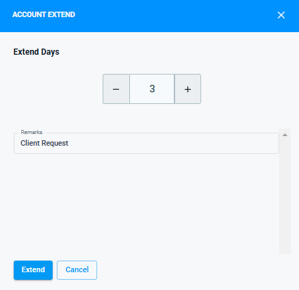{ style="display: block; margin: auto;" }

<i style="font-size: 14px; color: grey;">Fig. Statement</i>

