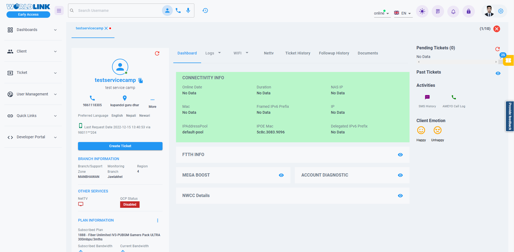

# Customer View

 <!-- NEED TO CHANGE IMAGE -->
 This section provides a comprehensive overview of the client’s profile, combining technical details, such as router settings and network configurations etc. with non-technical information, including personal details, plan information account information and more. This section provides everything you need to understand the client better and deliver a more personalized support experience.

{ style="display: block; margin: auto;" }

<i style="font-size: 14px; color: grey;">Fig. Customer View</i>

This section consists of many components. The list of them have been listed below:

1. [Username Tabs.](username-tabs.md)
1. [Customer Details.](customer-details.md)
1. [Feature Navigation Bar.](feature-navigation-bar.md)
1. [Pending Tickets.](pending-tickets.md)
1. [Past Tickets](past-tickets.md)
1. [Activities.](activities.md)
1. [Client Emotions.](client-emotions.md)