# Feature Navigation Bar

This is a simple feature that allows you to navigate between different features of the the dashboard. This consists of the following features:

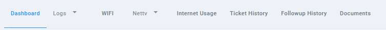{ style="display: block; margin: auto;" }

<i style="font-size: 14px; color: grey;">Fig. Feature Navigation Bar</i>

1. [Dashboard.](#dashboard)
1. [Logs.](#logs)
1. [Wi-Fi.](#wi-fi)
1. [Nettv.](#nettv)
1. [Internet Usage.](#internet-usage)
1. [Ticket History.](#ticket-history)
1. [Followup History.](#followup-history)
1. [Documents.](#documents)

## Dashboard 

This section provides detailed information about the ONU (Optical Network Unit) and the client’s internet connectivity, offering valuable insights into their network setup and performance. Additionally, it includes features such as Mega Boost, Account Diagnostics, and NWCC details to enhance troubleshooting.

!!! note
    This is the default view after entering a username.

### Connectivity Info

This section provides information about the client’s connection status. If the client is connected to the internet, the connectivity details will be displayed in green, highlighting all relevant connectivity information.

<!-- NEED TO CHANGE IMAGE -->
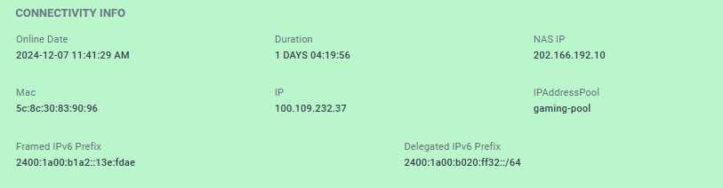{ style="display: block; margin: auto;" }

<i style="font-size: 14px; color: grey;">Fig. Connectivity Info when the client is connected</i>

 

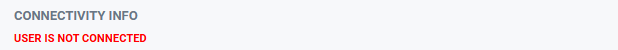{ style="display: block; margin: auto;" }

<i style="font-size: 14px; color: grey;">Fig. Connectivity Info when the client is not connected</i>

 

### FTTH INFO
This is the section where we can find the information related to the ONU of the client as well as the information regarding ACS and splitters.

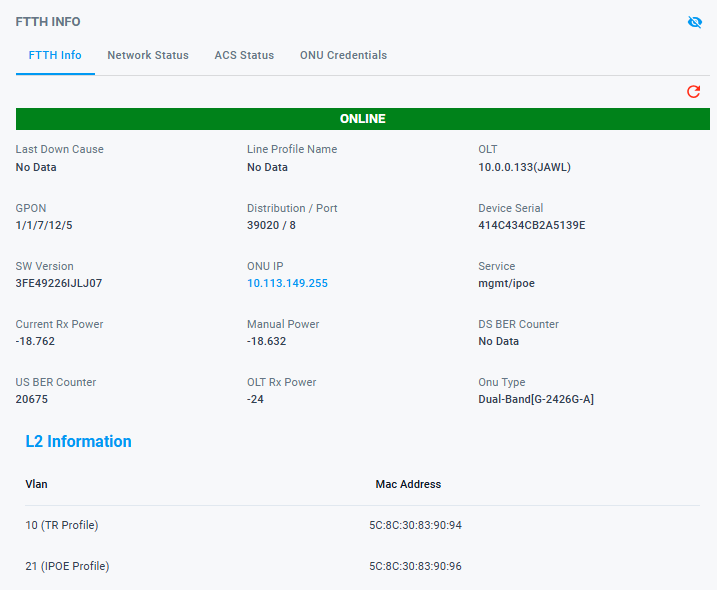{ style="display: block; margin: auto;" }

<i style="font-size: 14px; color: grey;">Fig. FTTH INFO</i>

 

Clicking on the `ONU IP` redirects to the ONU login page. The credentials for the ONU can be accessed through ONU credetntials section

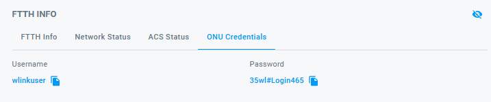{ style="display: block; margin: auto;" }

<i style="font-size: 14px; color: grey;">Fig. ONU Credentials</i>

 

### Network Status
This is the section where we find the total number of users that are connected to the GPON network.
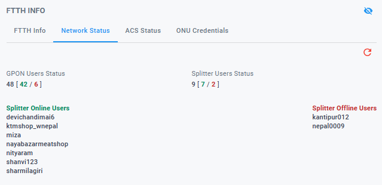{ style="display: block; margin: auto;" }

<i style="font-size: 14px; color: grey;">Fig. Network Status</i>

 

!!! note
    Clicking on the username will open a new tab dedicated to that user, providing quick access to their details and activities.

### ACS Status

This is the section that provides the details regarding the connection status of the ONU with the ACS server.
This information enables the identification of connectivity issues between ONU and ACS, facilitating the debugging of failures in executing ONU-related tasks via myWorldlink app and customer portal.

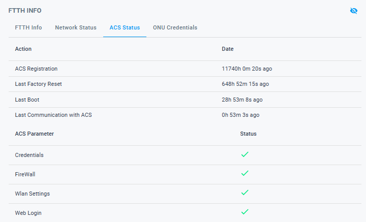{ style="display: block; margin: auto;" }

<i style="font-size: 14px; color: grey;">Fig. ACS Status</i>

 

## Logs

This section contains two types of logs: `Connection Logs` and `Port History Logs`, providing detailed insights into the device’s connectivity and port usage history.

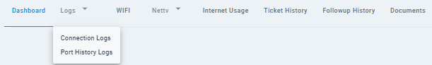{ style="display: block; margin: auto;" }

<i style="font-size: 14px; color: grey;">Fig. Logs List</i>

 

### Connection Logs
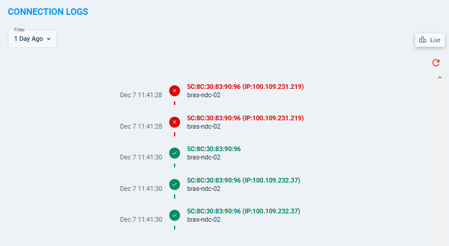{ style="display: block; margin: auto;" }

<i style="font-size: 14px; color: grey;">Fig. Connection Logs Timeline View</i>

 

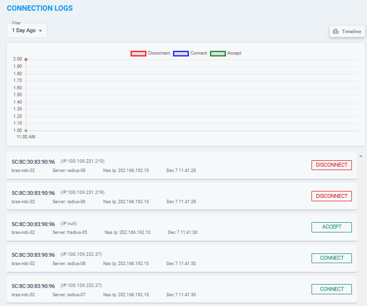{ style="display: block; margin: auto;" }

<i style="font-size: 14px; color: grey;">Fig. Connection Logs List View</i>

 

### Port History Logs
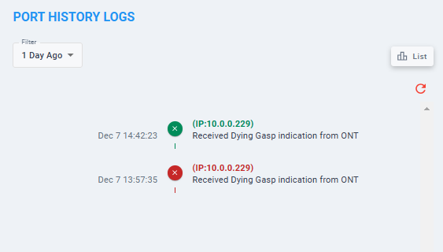{ style="display: block; margin: auto;" }

<i style="font-size: 14px; color: grey;">Fig. Port History Logs Timeline View</i>

 

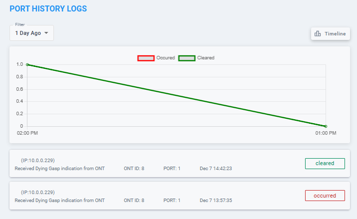{ style="display: block; margin: auto;" }

<i style="font-size: 14px; color: grey;">Fig. Port History Logs List View</i>

 
