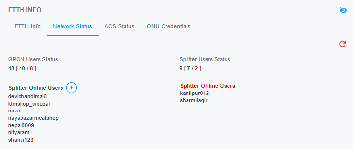
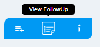

# Feature Navigation Bar

This is a simple feature that allows you to navigate between different features of the the dashboard. This consists of the following features:

{ style="display: block; margin: auto;" }

<i style="font-size: 14px; color: grey;">Fig. Feature Navigation Bar</i>

1. [Dashboard.](#dashboard)
1. [Logs.](#logs)
1. [Wi-Fi.](#wi-fi)
1. [Nettv.](#nettv)
1. [Internet Usage.](#internet-usage)
1. [Ticket History.](#ticket-history)
1. [Followup History.](#followup-history)
1. [Documents.](#documents)

## Dashboard 

This section provides detailed information about the ONU (Optical Network Unit) and the client’s internet connectivity, offering valuable insights into their network setup and performance. Additionally, it includes features such as Mega Boost, Account Diagnostics, and NWCC details to enhance troubleshooting.

!!! note
    This is the default view after entering a username.

### Connectivity Info

This section provides information about the client’s connection status. If the client is connected to the internet, the connectivity details will be displayed in green, highlighting all relevant connectivity information.

<!-- NEED TO CHANGE IMAGE -->
{ style="display: block; margin: auto;" }

<i style="font-size: 14px; color: grey;">Fig. Connectivity Info when the client is connected</i>

 

{ style="display: block; margin: auto;" }

<i style="font-size: 14px; color: grey;">Fig. Connectivity Info when the client is not connected</i>

 

### FTTH INFO
This is the section where we can find the information related to the ONU of the client as well as the information regarding ACS and splitters.

{ style="display: block; margin: auto;" }

<i style="font-size: 14px; color: grey;">Fig. FTTH INFO</i>

 

Clicking on the `ONU IP` redirects to the ONU login page. The credentials for the ONU can be accessed through ONU credetntials section

{ style="display: block; margin: auto;" }

<i style="font-size: 14px; color: grey;">Fig. ONU Credentials</i>

 

### Network Status
This is the section where we find the total number of users that are connected to the GPON network.
{ style="display: block; margin: auto;" }

<i style="font-size: 14px; color: grey;">Fig. Network Status</i>

 

!!! note
    Clicking on the username will open a new tab dedicated to that user, providing quick access to their details and activities.

### ACS Status

This is the section that provides the details regarding the connection status of the ONU with the ACS server.
This information enables the identification of connectivity issues between ONU and ACS, facilitating the debugging of failures in executing ONU-related tasks via myWorldlink app and Customer Portal.

{ style="display: block; margin: auto;" }

<i style="font-size: 14px; color: grey;">Fig. ACS Status</i>

 

## Logs

This section contains two types of logs: `Connection Logs` and `Port History Logs`, providing detailed insights into the device’s connectivity and port usage history.

{ style="display: block; margin: auto;" }

<i style="font-size: 14px; color: grey;">Fig. Logs List</i>

 

### Connection Logs
{ style="display: block; margin: auto;" }

<i style="font-size: 14px; color: grey;">Fig. Connection Logs Timeline View</i>

 

{ style="display: block; margin: auto;" }

<i style="font-size: 14px; color: grey;">Fig. Connection Logs List View</i>

 

### Port History Logs
{ style="display: block; margin: auto;" }

<i style="font-size: 14px; color: grey;">Fig. Port History Logs Timeline View</i>

 

{ style="display: block; margin: auto;" }

<i style="font-size: 14px; color: grey;">Fig. Port History Logs List View</i>

 

## Wi-Fi

### WIFI Details
This section lets you easily view the customer's Wi-Fi details. In the older version, eSupport, we could only see the SSID for the 2.4GHz band. With cSupport, you now get a complete view of both the 2.4GHz and 5GHz bands, including their Wi-Fi and broadcast statuses and the authentication mode. It’s a more detailed and user-friendly way to understand the customer’s issues.

{ style="display: block; margin: auto;" }

<i style="font-size: 14px; color: grey;">Fig. WIFI Details</i>

 

### Connected Devies
This section displays a list of devices currently connected to the client’s router, whether via Ethernet or Wi-Fi.

{ style="display: block; margin: auto;" }

<i style="font-size: 14px; color: grey;">Fig. Connected Devices Wi-Fi</i>

 

{ style="display: block; margin: auto;" }

<i style="font-size: 14px; color: grey;">Fig. Connected Devices Ethernet</i>

 

## NetTv

Under this section, you can check client's NetTv information and logs.

{ style="display: block; margin: auto;" }

<i style="font-size: 14px; color: grey;">Fig. Nettv</i>

 

### NetTv Details
This section will provide you with the number of NetTv the client has installed with its MAC address and package information. You can directly `ADD BONUS` and `EXTEND` without having to visit another application.

{ style="display: block; margin: auto;" }

<i style="font-size: 14px; color: grey;">Fig. Nettv Details</i>

 

- **Extend**
    This feature enables you to extend a client’s package in cases where their current package has expired, ensuring uninterrupted service.

{ style="display: block; margin: auto;" }

<i style="font-size: 14px; color: grey;">Fig. NetTv Extend</i>

  

- **Add Bonus:**
    The Add Bonus feature resolves cases where a customer's NETTV service is interrupted due to system issues, even though their internet package payment was successfully completed.

{ style="display: block; margin: auto;" }

<i style="font-size: 14px; color: grey;">Fig. Add Bonus</i>

  

## Internet Usage

The Internet Usage feature makes it easy to track how much data a client has used. You can see details for both uploads and downloads, and use the date filter to check usage during a specific time frame. It’s a simple way to monitor and understand a client’s internet activity, helping you provide better support and service.

{ style="display: block; margin: auto;" }

<i style="font-size: 14px; color: grey;">Fig. Internet Usage</i>

!!! note
    Clicking the arrow button lets you sort the dates to easily find the day with the highest data consumption.

## Ticket History

With the Ticket History feature, you can easily look through past tickets based on the problem type. Simply click on a problem type to view all related tickets. You can also use the date filter to focus on a specific time period by default it shows the data of past 7 days, making it easier to track and spot trends in support requests.

{ style="display: block; margin: auto;" }

<i style="font-size: 14px; color: grey;">Fig. Add Bonus</i>

  

## Followup History

With this feature, you can easily see all the remarks from previous follow-ups. It gives you a clear record of every interaction.

{ style="display: block; margin: auto;" }

<i style="font-size: 14px; color: grey;">Fig. Followup History</i>

  

- **View Followup**
    This section allows you to view the remarks from the previous follow-ups.

{ style="display: block; margin: auto;" }

<i style="font-size: 14px; color: grey;">Fig. View Followup</i>

 

{ style="display: block; margin: auto;" }

<i style="font-size: 14px; color: grey;">Fig. Followup Remarks</i>

 

- **Add Followup**
    This section allows you to post remarks after completing a follow-up with the client, ensuring that all interactions are documented for future reference.

{ style="display: block; margin: auto;" }

<i style="font-size: 14px; color: grey;">Fig. Add Followup</i>

 

{ style="display: block; margin: auto;" }

<i style="font-size: 14px; color: grey;">Fig. Post Remarks</i>

 

## Documents

This section contains all the documents related to the client, including those uploaded during the installation process and any additional documents submitted by the client via the myWorldLink app.

{ style="display: block; margin: auto;" }

<i style="font-size: 14px; color: grey;">Fig. Documents</i>

 