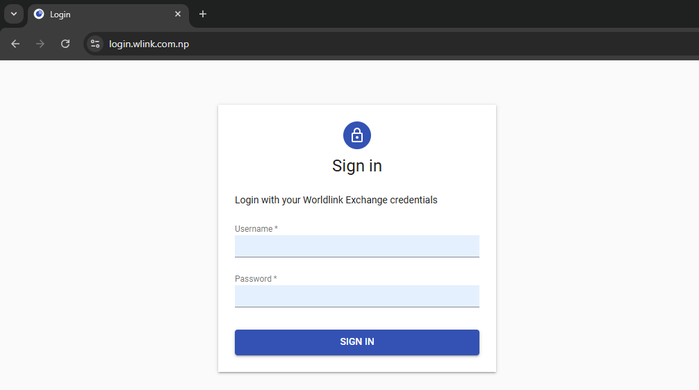

# Getting Started

## Login to cSupport Dashboard

Unlike eSupport, which had a separate login page, cSupport now uses Worldlink's OAuth authorization  [`https://login.wlink.com.np`](https://login.wlink.com.np) the same system used for logging into other internal applications. This means you can enjoy a smooth, hassle-free login experience. With OAuth, you only need to sign in once, and you’re automatically granted access to cSupport and other internal tools. You can directly visit  [`https://csupport-dashboard.wlink.com.np`](https://csupport-dashboard.wlink.com.np) as well.

## Prerequisities

* **Valid WorldLink Exchange ID**: Ensure your Exchange ID has a valid email address associated with it.
* **SMSCAST Integration**: Your Exchange ID must be registered in the [SMSCAST](https://smscast.wlink.com.np) system. 
* **cSupport Dashboard Access**: If you lack access, please contact your immediate supervisor for authorization.

