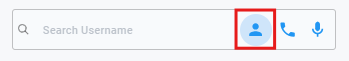
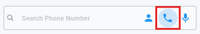
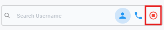

# Navigation Bar
{ style="display: block; margin: auto;" }

This is the Navation Bar where you will find the following components:

## User Search

{ style="display: block; margin: auto;" }

<i style="font-size: 14px; color: grey">Fig. Search by Username</i>

**1. Search by Username** : 
Simply type a username into the search bar to look for customers. If the username exists, a dropdown will appear with suggestions to help you find the correct one quickly.

{ style="display: block; margin: auto;" }

<i style="font-size: 14px; color: grey">Fig. Search by Phone Number</i>

**2. Search by Phone Number** :
Enter a phone number in the search bar to get a list of usernames associated with it. This helps you quickly find the relevant accounts linked to that number.

{ style="display: block; margin: auto;" }

<i style="font-size: 14px; color: grey">Fig. Search by Voice</i>

**3. Search by Voice** : 
Speak into the mic of your device in the search bar to get a list of usernames.
!!! note
    Please make sure that you have enabled the microphone permission to use this feature.

## User Status
