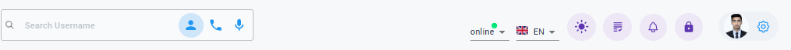
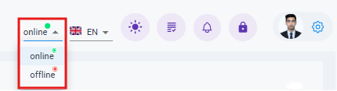

# Navigation Bar
{ style="display: block; margin: auto;" }

This is the Navation Bar where you will find the following components:

## User Search

{ style="display: block; margin: auto;" }

<i style="font-size: 14px; color: grey">Fig. Search by Username</i>

**1. Search by Username** : 
Simply type a username into the search bar to look for customers. If the username exists, a dropdown will appear with suggestions to help you find the correct one quickly.

{ style="display: block; margin: auto;" }

<i style="font-size: 14px; color: grey">Fig. Search by Phone Number</i>

**2. Search by Phone Number** :
Enter a phone number in the search bar to get a list of usernames associated with it. This helps you quickly find the relevant accounts linked to that number.

{ style="display: block; margin: auto;" }

<i style="font-size: 14px; color: grey">Fig. Search by Voice</i>

**3. Search by Voice** : 
Speak into the mic of your device in the search bar to get a list of usernames.
!!! note
    Please make sure that you have enabled the microphone permission to use this feature.

## User Status

{ style="display: block; margin: auto;" }

<i style="font-size: 14px; color: grey">Fig. User-Status</i>

From this section, you can easily toggle between online and offline statuses to manage user availability.

## Languages
{ style="display: block; margin: auto;" }

<i style="font-size: 14px; color: grey">Fig. Languages</i>

You can toggle between your preferred languages i.e English and Nepali
## Dark Mode
{ style="display: block; margin: auto;" }

<i style="font-size: 14px; color: grey">Fig. Dark Mode</i>

This Feature allows you to toggle between Light and Dark modes.

## Tutorial Mode

{ style="display: block; margin: auto;" }

<i style="font-size: 14px; color: grey">Fig. Tutorial Mode</i>

This feature will provide you a short tour of the application providing you with the basic configurations of the application.
## Notifications

<!-- { style="display: block; margin: auto;" }

<i style="font-size: 14px; color: grey">Fig. Notifications</i> -->

This section will provide you with the notifications regarding the ticket assignments degredation mode etc.

## App Lock

{ style="display: block; margin: auto;" }

<i style="font-size: 14px; color: grey">Fig. App Lock Button</i>

This feature allows you to lock your applicaiton.

!!! note
    Once you lock the application, your availability will automatically be switched to offline.

### Lock Screen

{ style="display: block; margin: auto;" }

<i style="font-size: 14px; color: grey;">Fig. Lock Screen</i>

The password for this section is the same as your Exchange account password.

**1. Login Button**: Allows you to log into the system.  
**2. Logout Button**: Allows you to securely log out of the system.  
**3. Notification Section**: Displays system notifications and updates.

## User Settings