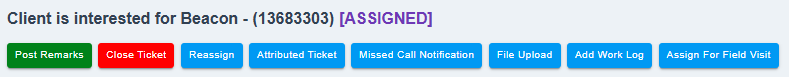
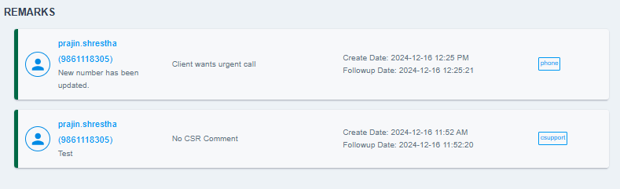
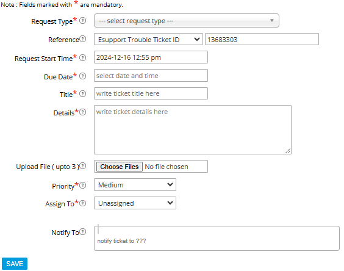
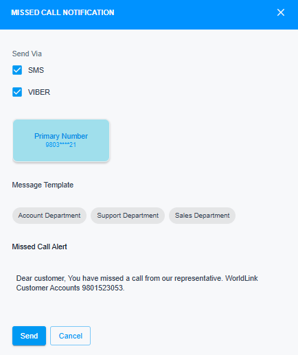
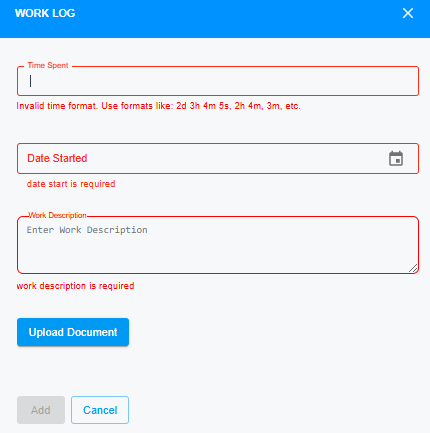
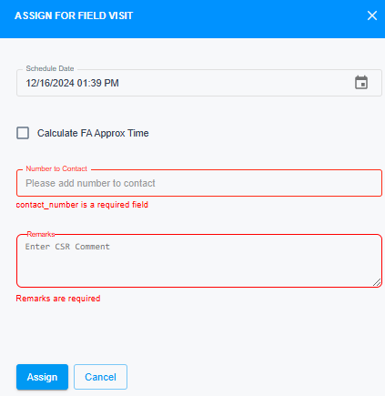

# Ticket Actions

<!-- NEED TO CHANGE IMAGE -->
{ style="display: block; margin: auto;" }

<i style="font-size: 14px; color: grey;">Fig. Ticket Actions</i>

This is the section that consists of different actions that you can perform on a single ticket. The actions are embedded in the button. The list of buttons are as below:

1. [Post Remarks.](#post-remarks)
1. [Close Ticket.](#close-ticket-and-reassign-button)
1. [Reassign.](#close-ticket-and-reassign-button)
1. [Attributed Ticket.](#attributed-ticket)
1. [Missed Call Notification.](#missed-call-notification)
1. [Add Work Log.](#add-work-log)
1. [Assign For Field Visit.](#assign-for-field-visit-and-reschedule)
1. [Reschedule.](#assign-for-field-visit-and-reschedule)

## Post Remarks

This feature allows you to write  remarks based on the client’s words after a follow-up or a subsequent call. After posting the remarks, it will be reflected in the Remarks table as follows: 

{ style="display: block; margin: auto;" }

<i style="font-size: 14px; color: grey;">Fig. Post Remarks</i>

 

## Close Ticket and Reassign Button  

This button allows users to close and reassign a ticket. Its visibility depends on the following conditions:  

**For QCP Enabled Branches**:  
1. The logged-in user must belong to the Head Office.  
2. The logged-in user must be part of the Accounts Branch Team. *(Applicable only for closing and reassigning Account and IPTV-related tickets.)*  

**For QCP Disabled Branches**:  
1. Users from non-QCP enabled branches can close and reassign tickets without restrictions.

## Attributed Ticket

This button redirects you to the Task Ticketing (TT) platform through which you can open a TT ticket. The details regarding this will be updated in [Related Tickets](ticket-tables.md/#related-tickets) table.

{ style="display: block; margin: auto;" }

<i style="font-size: 14px; color: grey;">Fig. TT Platform</i>

 

**Visibility Conditions:** 
The user should be under the following groups:

- Administrator.
- Enterprise Support.
- Enterprise Sales Manager.
- Enterprise Team.
- Enterprise L1 Support.
- Enterprise L2 Support.
- Enterprises Support Admin.

!!! note
    Close ticket button will be disabled in cSupport if the attribute(TT) ticket is pending.

## Missed Call Notification

This feature lets you send a notification via SMS or Viber if the client is unreachable during a follow-up call. You can select from different templates based on your department.

{ style="display: block; margin: auto;" }

<i style="font-size: 14px; color: grey;">Fig. Missed Call Notification</i>

## Add Work Log

This section lets you add comments, record the time spent, and attach any documents related to the issues. The details regarding this will be updated in [Work Log](ticket-tables.md/#work-log) table.

{ style="display: block; margin: auto;" }

<i style="font-size: 14px; color: grey;">Fig. Add Work Log</i>

 

## Assign For Field Visit and Reschedule.

This feature lets you assign the ticket to queue. If the ticket is already in queue and the status is parked, then Reschedule button will appear.

{ style="display: block; margin: auto;" }

<i style="font-size: 14px; color: grey;">Fig. Assign For Field Visit</i>

**Visibility Conditions:**

- Client's branch should be QCP enabled.
- The ticket opened should not be Account Related.
- Ticket status in queue should be "HOLD" for Reschedule button to appear.

