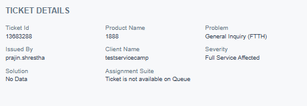
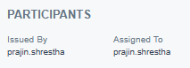
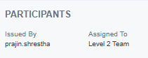
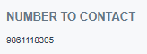
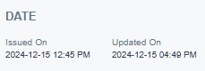
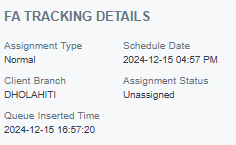
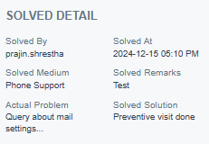

# Ticket Cards

There are total of 5 cards which represent different information related to the ticket. The list of the cards are:

1. [Ticket Details](#ticket-details)
1. [Participants](#participants)
1. [Number to Contact](#number-to-contact)
1. [Date](#date)
1. [FA Tracking Details](#fa-tracking-details)

## Ticket Details
This section displays ticket details such as Ticket ID, Issued By, Assignment Suite, and more. The Assignment Suite is especially useful for checking if the ticket is in the queue.

{ style="display: block; margin: auto;" }

<i style="font-size: 14px; color: grey;">Fig. Ticket Details</i>

## Participants

This section provides information about the user who created the ticket and the individual or group it is assigned to.

{ style="display: block; margin: auto;" }

<i style="font-size: 14px; color: grey;">Fig. Assigned to Individual</i>

 

{ style="display: block; margin: auto;" }

<i style="font-size: 14px; color: grey;">Fig. Assigned to Group</i>

## Number to Contact

This card displays the contact number to reach the client, which is specified when assigning the ticket.

{ style="display: block; margin: auto;" }

<i style="font-size: 14px; color: grey;">Fig. Number to Contact</i>

## Date

This card displays the date and time when the ticket was created and updated on. `Latest time of update will be displayed`

{ style="display: block; margin: auto;" }

<i style="font-size: 14px; color: grey;">Fig. Date</i>

## FA Tracking Details

This card shows the ticket's queue details, such as queue insertion time, branch, scheduled date, and current status. `These details are visible only if the ticket is in the queue.`

{ style="display: block; margin: auto;" }

<i style="font-size: 14px; color: grey;">Fig. FA Tracking Details</i>

## Solve Details

This card is visible only after the ticket has been closed. 

{ style="display: block; margin: auto;" }

<i style="font-size: 14px; color: grey;">Fig. Solve Details</i>

