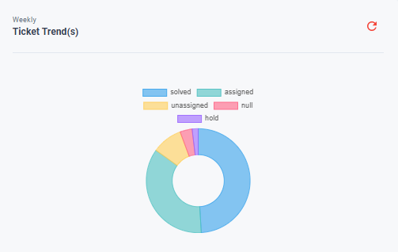

# Ticket Details

## Individual Pending Tickets
{ style="display: block; margin: auto;" }

<i style="font-size: 14px; color: grey">Fig. Individual Pending Tickets</i>

This section displays all the tickets that have been assigned to you. 

## Group Pending Tickets

{ style="display: block; margin: auto;" }

<i style="font-size: 14px; color: grey">Fig. Group Pending Tickets</i>

 
This section displays all the tickets that have been assigned to your group. 

## Weekly Ticket Trends

{ style="display: block; margin: auto;" }

<i style="font-size: 14px; color: grey">Fig. Weekly Ticket Trends</i>

This section features a pie chart that visualizes ticket trends over the past week.

## Daily Problem Trends

{ style="display: block; margin: auto;" }

<i style="font-size: 14px; color: grey">Fig. Daily Problem Trends</i>

This section provides with the count of tickets that have been opened in the specific problem type.