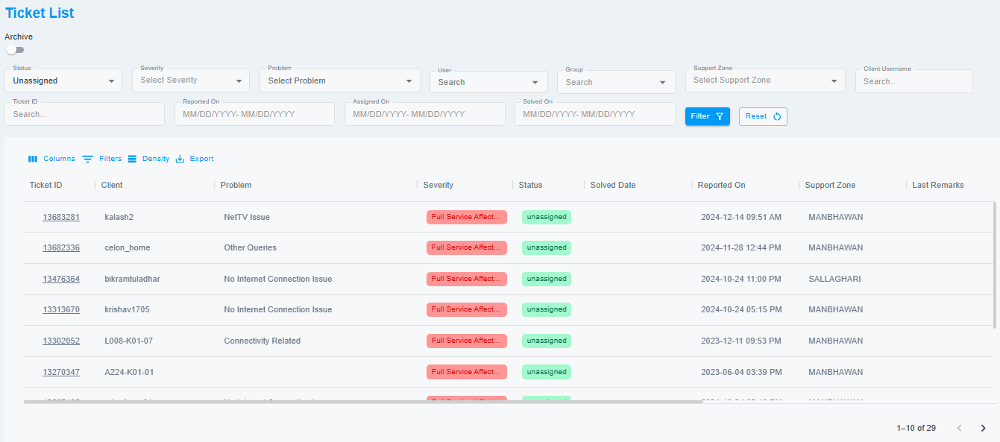
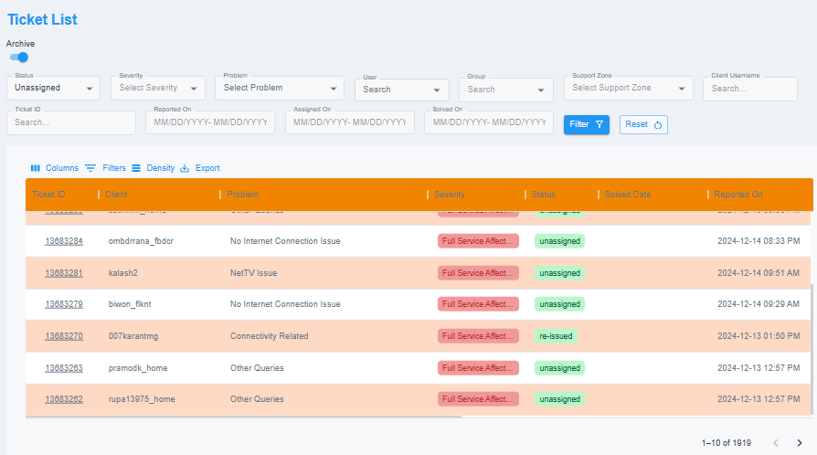

# Ticket List

This section provides a tabular view of tickets specific to your branch. By default, it displays unassigned tickets upon opening. You can apply various filters to customize the ticket list and find the tickets that meet your requirements.

{ style="display: block; margin: auto;" }

<i style="font-size: 14px; color: grey;">Fig. Ticket List</i>

 

## Archive Mode

This feature allows you to view the tickets that are older than 6 months.

{ style="display: block; margin: auto;" }

<i style="font-size: 14px; color: grey;">Fig. Ticket List</i>

 