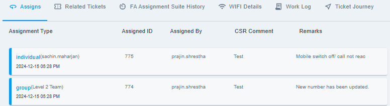
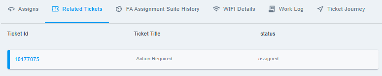
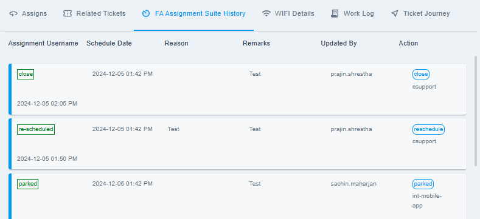
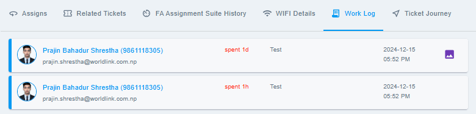
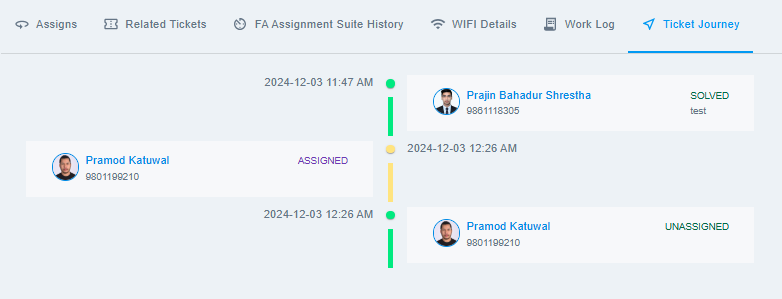

# Ticket Tables

{ style="display: block; margin: auto;" }

<i style="font-size: 14px; color: grey;">Fig. Ticket Tables</i>

 

This section includes four tables and a visual representation of the ticket's journey. The components of this section are listed below:

1. [Assigns.](#assigns)
1. [Related Tickets.](#related-tickets)
1. [FA Assignment Suite History.](#fa-assignment-suite-history)
1. [Wifi Details.](feature-navigation-bar.md/#wi-fi) *(Exact to Customer View)*
1. [Work Log.](#work-log)
1. [Ticket Journey.](#ticket-journey)

## Assigns

This section provides information about the ticket's assign history which includes the assignment type (Assigned to Group or Individual), Assigned by, CSR comment and Remarks.

{ style="display: block; margin: auto;" }

<i style="font-size: 14px; color: grey;">Fig. Assigns Table</i>

 

## Related Tickets

This section contains information about the task tickets (TT tickets) that are associated with the current trouble ticket. Mostly, the related tickets are ONM related (Network expansion or Outages).

{ style="display: block; margin: auto;" }

<i style="font-size: 14px; color: grey;">Fig. Related Tickets</i>

 

!!! note
    You will not be allowed to close the ticket until the related tickets are closed.

## FA Assignment Suite History

This section summarizes the ticket's time in the queue, detailing the actions performed during that period.

{ style="display: block; margin: auto;" }

<i style="font-size: 14px; color: grey;">Fig. FA Assignment Suite History</i>

 

## Work Log

This section provides details about the ticket's work log, including comments, time spent by users, and any documents updated in the work log.

{ style="display: block; margin: auto;" }

<i style="font-size: 14px; color: grey;">Fig. Work Log Table</i>

 

## Ticket Journey

This section provides a graphical representation of the ticket's journey which includes the information about the ticket status, when it was assigned and solved etc..

{ style="display: block; margin: auto;" }

<i style="font-size: 14px; color: grey;">Fig. Ticket Journey</i>

 

