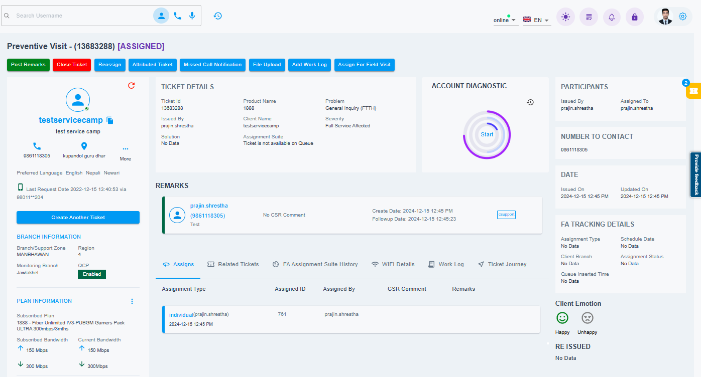

# Ticket View

The Ticket View provides a comprehensive view of a single support ticket. It displays all relevant details, including the client's information, the problem description, ticket status, and any associated notes or updates. This dashboard allows you to track the ticket’s progress, view its history, and manage communications with the client. You can also update the ticket status, assign it to team members, and schedule field visits.

{ style="display: block; margin: auto;" }

<i style="font-size: 14px; color: grey;">Fig. Ticket View</i>

 

This dashboard consists of different components. Some of them are listed below:

1. [Customer Details.](customer-details.md) (*Exact to Customer View* )
1. [Ticket Actions.](ticket-actions.md)
1. [Ticket Cards.](ticket-cards.md)
1. [Ticket Tables.](ticket-tables.md)
1. [SLA Timeline](SLA-timeline.md)

!!! note
     You will only be allowed to view the tickets of the branch you  belong to.