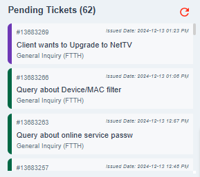
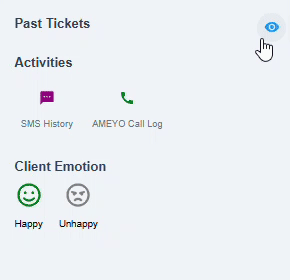

# Tickets

This feature is located at the right side of the customer search dashboard. This feature is divided into two categories:

1. [Pending Tickets.](##pending-tickets)
1. [Past Tickets.](##past-tickets)

## Pending Tickets

This feature provides an overview of the client’s pending tickets, allowing you to quickly access and review all unresolved issues along with their details. The tickets are preloaded for your convenience, ensuring an efficient workflow.

{ style="display: block; margin: auto;" }

<i style="font-size: 14px; color: grey;">Fig. Pending Tickets</i>

 

## Past Tickets

This feature allows you to view the client’s past tickets, providing access to resolved or closed issues along with their details. Unlike pending tickets, past tickets are not preloaded and will require you to manually load the information as needed.

{ style="display: block; margin: auto;" }

<i style="font-size: 14px; color: grey;">Fig. Past Tickets</i>

 