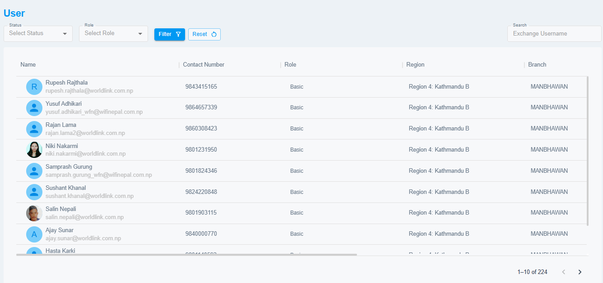

# User

This section allows you to view the list of the users that belong to your branch and check their status as well as their role in cSupport.  

{ style="display: block; margin: auto;" }

<i style="font-size: 14px; color: grey;">Fig. User</i>

 

!!! note
    Users of your branch will only be visible.