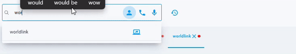
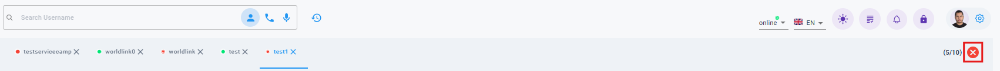
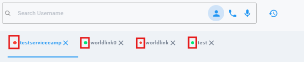

# Username Tabs

Unlike the previous version, which required opening a new browser tab for each username, leading to cluttered navigation, cSupport streamlines the process by allowing you to manage multiple usernames within the same tab. You can view and work with up to 10 different usernames on a single page, making navigation cleaner and more efficient.

{ style="display: block; margin: auto;" }

<i style="font-size: 14px; color: grey;">Fig. Username Tabs</i>

 

## Close All Tabs

This is a feature that enables you to close all the tabs with just one click.

{ style="display: block; margin: auto;" }

<i style="font-size: 14px; color: grey;">Fig. Close All Tabs</i>

 

## Router/ONU Status

The status of the client's router/ONU is displayed in the username tabs itself. Green if the ONU is online and Red if its offline.

{ style="display: block; margin: auto;" }

<i style="font-size: 14px; color: grey;">Fig. Router/Online Status</i>

